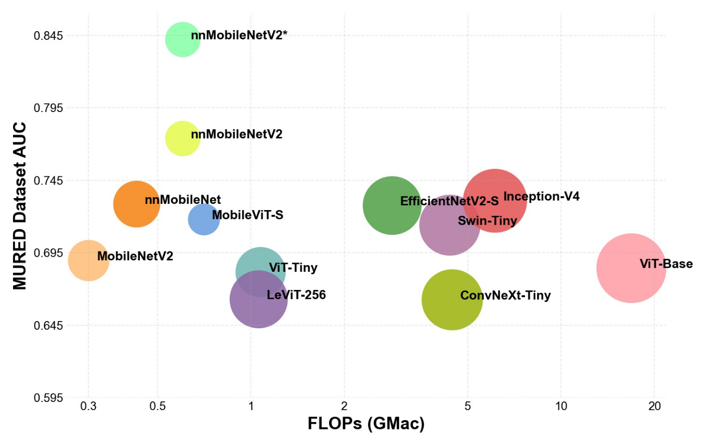
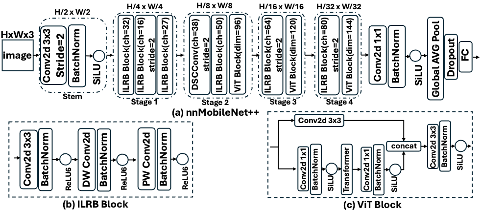

# nnMobileNet++: Towards Efficient Hybrid Networks for Retinal Image Analysis**

Xin Li, Wenhui Zhu, XUANZHAO DONG, Hao Wang, Yujian Xiong, Oana Dumitrascu, Yalin Wang


#### Abstract

Retinal imaging is a critical, non-invasive modality for the early detection and monitoring of ocular and systemic diseases. Deep learning, particularly convolutional neural networks (CNNs), has significant progress in automated retinal analysis, supporting tasks such as fundus image classification, lesion detection, and vessel segmentation. As a representative lightweight network, nnMobileNet has demonstrated strong performance across multiple retinal benchmarks while remaining computationally efficient. However, purely convolutional architectures inherently struggle to capture long-range dependencies and model the irregular lesions and elongated vascular patterns that characterize on retinal images, despite the critical importance of vascular features for reliable clinical diagnosis. To further advance this line of work and extend the original vision of nnMobileNet, we propose nnMobileNet++, a hybrid architecture that progressively bridges convolutional and transformer representations. The framework integrates three key components: (i) dynamic snake convolution for boundary-aware feature extraction, (ii) stage-specific transformer blocks introduced after the second down-sampling stage for global context modeling, and (iii) retinal image pretraining to improve generalization. Experiments on multiple public retinal datasets for classification, together with ablation studies, demonstrate that nnMobileNet++ achieves state-of-the-art or highly competitive accuracy while maintaining low computational cost, underscoring its potential as a lightweight yet effective framework for retinal image analysis.







#### Prerequisites

```
https://github.com/Retinal-Research/NN-MobileNet_plus.git
cd NN-MobileNet_plus
conda env create -f environment.yml
conda activate nnmobilenetpp
```


#### Datasets

* [MuReD — Multi-Label Retinal Diseases](https://www.kaggle.com/datasets/abhirampolisetti/multi-label-retinal-disease-mured-dataset)
* [ODIR — Ocular Disease Intelligent Recognition](https://www.kaggle.com/datasets/andrewmvd/ocular-disease-recognition-odir5k)
* [MMAC 2023 — Myopic Maculopathy Analysis Challenge](https://codalab.lisn.upsaclay.fr/competitions/12477)
* [MICCAI UWF4DR 2024 - Ultra-Widefield Fundus Imaging for Diabetic Retinopathy](https://codalab.lisn.upsaclay.fr/competitions/18605)
* [MuCaRD 2025 — Multi-Camera Robust Diagnosis of Fundus Diseases](https://www.codabench.org/competitions/9237/)


**Weights**

[Download here]() (will update later)


#### Visualization


#### **Acknowledgements**

This work builds upon several excellent open-source projects and prior research contributions. We sincerely thank the authors and communities behind the following resources:

* [nnMobileNet](https://github.com/Retinal-Research/NN-MOBILENET)
* [MobileViT](https://github.com/chinhsuanwu/mobilevit-pytorch)
* [SimMIM](https://github.com/microsoft/SimMIM)
* [DSCNet](https://github.com/YaoleiQi/DSCNet)
